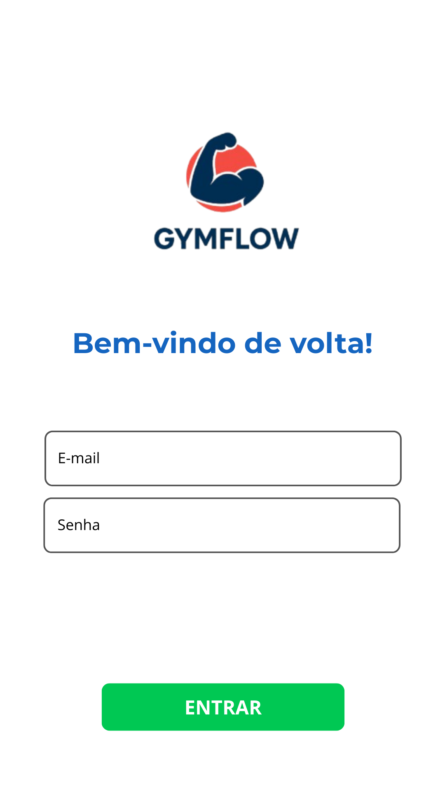
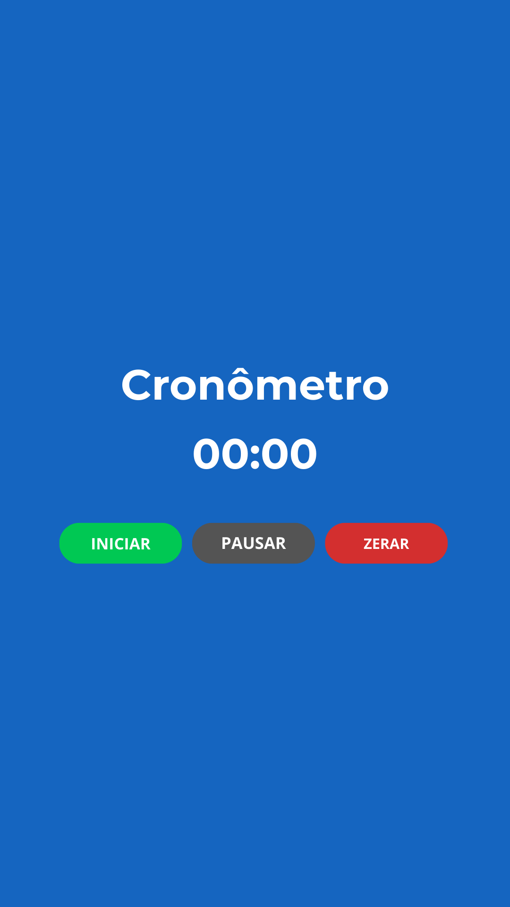

# Aplicação Mobile

O front-end móvel deste projeto consiste no desenvolvimento de uma aplicação Android construída utilizando Kotlin e o framework Jetpack Compose. O objetivo principal é fornecer uma interface moderna, eficiente e responsiva para que os usuários possam acessar as funcionalidades do sistema de forma intuitiva. A aplicação busca entregar uma experiência fluida, com navegação simplificada, organização clara das telas e integração direta com a API responsável pelos dados.

---

## Projeto da Interface

A interface foi projetada seguindo os princípios do Material Design, adaptados ao Jetpack Compose. As telas utilizam componentes declarativos, permitindo uma construção modular, reutilizável e reativa aos estados da aplicação.

- Principais características da interface:

- Layouts compostos utilizando Scaffold, Column, Row e LazyColumn.

- Navegação entre telas construída com Navigation Compose.

- Componentes interativos como botões, cards e campos de entrada personalizados.

- Estrutura de telas organizada para facilitar: consulta de informações, edição de dados, cadastros, navegação entre funcionalidades principais.

- Cada tela foi pensada para minimizar a carga cognitiva do usuário, exibindo apenas o que é necessário em cada contexto.

---

### Wireframes

Os wireframes a seguir representam o esboço visual das principais telas do GymFlow, aplicativo mobile voltado à organização e acompanhamento de treinos. Esta etapa teve como objetivo definir a estrutura visual e funcional do sistema, facilitando a visualização do fluxo de navegação do usuário entre as telas de login, menu inicial, cronômetro e perfil.

O uso de wireframes permitiu validar antecipadamente a experiência do usuário (UX), garantindo que a disposição dos elementos na interface seja intuitiva, acessível e coerente com a proposta do aplicativo. A seguir, são apresentados os wireframes desenvolvidos para o GymFlow, que serviram de base para o desenvolvimento do protótipo funcional:

##### Tela Inicial

##### Tela de Cadastro

##### Tela de Login

##### Menu Principal

##### Cronômetro

##### Perfil do Usuário

##### Editar Perfil

##### Meus Treinos

##### Criar Novo Treino

##### Criar Ficha

##### Selecionar Exercícios

### Design Visual

**Paleta de cores**

- **Primária (#1565C0)** — Azul intenso utilizado nos títulos, links e elementos de destaque. Transmite **confiança, estabilidade e foco**.
- **Secundária (#121212)** — Cor **escura** usada em fundos e áreas de contraste.
- **Apoio (#00C853)** — Verde vibrante que destaca **botões de ação** (como “CADASTRE-SE”), indicando **sucesso e positividade**.
- **Neutros (#616161 e #FFFFFF)** — Tons de **cinza médio e branco puro** para equilibrar o contraste e garantir boa legibilidade.
- **Feedback (#FF6D00 e #D32F2F)** — Tons de **laranja** e **vermelho** aplicados para **alertas e erros**.

**Tipografia**

- **Títulos:** _Archivo Black_ — Fonte, que reforça a **força e a presença** da marca.
- **Textos e rótulos:** _Montserrat_ — Moderna e legível, garantindo **clareza e leveza** no corpo do texto e nos campos de formulário.

**Ícones e Elementos Gráficos**

O logotipo em azul escuro sobre um círculo vermelho-alaranjado, simbolizando energia, determinação e superação — valores centrais da marca. Os ícones secundários, como o **ícone de exibição de senha**, seguindo a consistência visual do sistema.

**Geral**

O design do GymFlow comunica **energia e modernidade**. A combinação de azul e verde reforça **confiança e progresso**, enquanto a tipografia e os ícones tornam a experiência **acessível e agradável**. O resultado é uma interface ideal para um app voltado à organização e acompanhamento de treinos.

## Fluxo de Dados

### 1. Login (Mobile)

| Etapa | Origem       | Destino               | Tipo de Dado     | Descrição                                                 |
| ----- | ------------ | --------------------- | ---------------- | --------------------------------------------------------- |
| 1     | Usuário      | App (Mobile)          | Texto            | Inserção de email e senha                                 |
| 2     | App (Mobile) | App (Mobile)          | Texto / Booleano | Validação dos campos (formato do email e senha não vazia) |
| 3     | App (Mobile) | API `/auth/login`     | JSON             | Envio das credenciais `{ email, senha }`                  |
| 4     | API          | App (Mobile)          | JSON             | Retorno do token JWT ou mensagem de erro                  |
| 5     | App (Mobile) | Armazenamento interno | String           | Salvamento do token JWT                                   |
| 6     | App (Mobile) | Menu Inicial          | Navegação        | Redirecionamento após autenticação                        |

---

### 2. Cadastro de Usuário (Mobile)

| Etapa | Origem       | Destino              | Tipo de Dado     | Descrição                                |
| ----- | ------------ | -------------------- | ---------------- | ---------------------------------------- |
| 1     | Usuário      | App (Mobile)         | Texto            | Inserção de nome, email e senha          |
| 2     | App (Mobile) | App (Mobile)         | Texto / Booleano | Validação dos campos obrigatórios        |
| 3     | App (Mobile) | API `/auth/register` | JSON             | Envio dos dados `{ nome, email, senha }` |
| 4     | API          | App (Mobile)         | JSON             | Retorno de sucesso ou erro               |
| 5     | App (Mobile) | Usuário              | Texto            | Exibição da mensagem de confirmação      |
| 6     | App (Mobile) | Tela de Login        | Navegação        | Redirecionamento após cadastro           |

---

### 3. Menu Inicial (Mobile)

| Etapa | Origem       | Destino               | Tipo de Dado | Descrição                                      |
| ----- | ------------ | --------------------- | ------------ | ---------------------------------------------- |
| 1     | App (Mobile) | Armazenamento interno | String       | Verificação do token JWT                       |
| 2     | Usuário      | App (Mobile)          | Evento       | Navegação para Treinos, Perfil ou Criar Treino |
| 3     | App (Mobile) | Telas Internas        | Navegação    | Direcionamento conforme escolha do usuário     |

---

### 4. Listagem de Treinos (Mobile)

| Etapa | Origem       | Destino                      | Tipo de Dado  | Descrição                                     |
| ----- | ------------ | ---------------------------- | ------------- | --------------------------------------------- |
| 1     | App (Mobile) | Armazenamento interno        | String        | Leitura do token JWT                          |
| 2     | App (Mobile) | API `/treinos/user/{idUser}` | GET           | Requisição de todos os treinos do usuário     |
| 3     | API          | App (Mobile)                 | JSON          | Retorno da lista de treinos                   |
| 4     | App (Mobile) | Interface                    | Lista / Texto | Renderização dos treinos na tela              |
| 5     | Usuário      | App (Mobile)                 | Evento        | Seleciona um treino para visualizar as fichas |

---

### 5. Interior do Treino — Listagem de Fichas

| Etapa | Origem       | Destino                    | Tipo de Dado | Descrição                                           |
| ----- | ------------ | -------------------------- | ------------ | --------------------------------------------------- |
| 1     | App (Mobile) | API `/fichas?treinoId=...` | GET          | Busca todas as fichas do treino                     |
| 2     | API          | App (Mobile)               | JSON         | Retorno de `{ id, diaSemana }`                      |
| 3     | App (Mobile) | Interface                  | Lista        | Exibição das fichas cadastradas                     |
| 4     | Usuário      | App (Mobile)               | Evento       | Seleciona uma ficha para visualizar seus exercícios |

---

### 6. Exercícios da Ficha

| Etapa | Origem       | Destino                             | Tipo de Dado | Descrição                                         |
| ----- | ------------ | ----------------------------------- | ------------ | ------------------------------------------------- |
| 1     | App (Mobile) | API `/fichas/exercicio?idFicha=...` | GET          | Busca os exercícios vinculados à ficha            |
| 2     | API          | App (Mobile)                        | JSON         | Retorno com nome, carga, repetições, descanso etc |
| 3     | App (Mobile) | Interface                           | Lista        | Exibição dos exercícios cadastrados               |
| 4     | Usuário      | App (Mobile)                        | Evento       | Adição de um novo exercício                       |
| 5     | App (Mobile) | API `/fichas/exercicio`             | JSON (POST)  | Cadastro do exercício na ficha                    |
| 6     | API          | App (Mobile)                        | JSON         | Retorno com confirmação e IDs                     |
| 7     | App (Mobile) | Interface                           | Atualização  | Lista atualizada automaticamente                  |

---

### 7. Criação de Treino — CadEx.kt

| Etapa | Origem       | Destino                 | Tipo de Dado    | Descrição                                          |
| ----- | ------------ | ----------------------- | --------------- | -------------------------------------------------- |
| 1     | Usuário      | App (Mobile)            | Texto / Seleção | Inserção do nome do treino + seleção de exercícios |
| 2     | App (Mobile) | API `/treinos`          | JSON            | Criação do treino `{ nome, dataInicio, dataFim }`  |
| 3     | API          | App (Mobile)            | JSON            | Retorno com `idTreino`                             |
| 4     | App (Mobile) | API `/fichas`           | JSON            | Criação da ficha vinculada ao treino               |
| 5     | App (Mobile) | API `/fichas/exercicio` | JSON            | Inclusão dos exercícios selecionados               |
| 6     | API          | App (Mobile)            | JSON            | Confirmando criação                                |
| 7     | App (Mobile) | Interface               | Texto           | Exibe mensagem de sucesso                          |
| 8     | App (Mobile) | Menu Inicial            | Navegação       | Retorno após concluir                              |

---

### 8. Perfil do Usuário (Mobile)

| Etapa | Origem       | Destino               | Tipo de Dado   | Descrição                           |
| ----- | ------------ | --------------------- | -------------- | ----------------------------------- |
| 1     | App (Mobile) | Armazenamento interno | String         | Verificação do token                |
| 2     | App (Mobile) | API `/usuarios/{id}`  | GET            | Busca dos dados do usuário          |
| 3     | API          | App (Mobile)          | JSON           | Retorno com nome, email, idade etc. |
| 4     | App (Mobile) | Interface             | Texto          | Preenchimento da tela               |
| 5     | Usuário      | App (Mobile)          | Texto / Número | Edição dos dados                    |
| 6     | App (Mobile) | API `/usuarios/{id}`  | JSON           | Envio dos dados atualizados         |
| 7     | API          | App (Mobile)          | JSON           | Retorno de sucesso                  |
| 8     | App (Mobile) | Interface             | Texto          | Exibição do resultado               |

---

## Tecnologias Utilizadas

| Categoria                         | Tecnologia / Ferramenta                                   |
|-----------------------------------|------------------------------------------------------------|
| Linguagem                         | Kotlin                                                     |
| Interface (UI)                    | Jetpack Compose                               |
| Navegação                         | Navigation Compose                                         |
| Assincronismo                     | Coroutines                                                 |
| Consumo de API                    | Retrofit ou Ktor Client                                    |
| Containerização                   | Docker                                                     |
| Controle de Versão                | GitHub (repositório remoto)                                |
| Hospedagem                        | Local                                                     |
| Banco de Dados (via Backend)      | PostgreSQL                                                 |

---

## Considerações de Segurança

A implantação do aplicativo móvel e do backend foi estruturada para garantir estabilidade, escalabilidade e facilidade de manutenção. O backend, desenvolvido em Java/Spring Boot, é hospedado na plataforma Heroku, que realiza o deploy manual a partir do repositório Git, garantindo controle total sobre cada atualização. A aplicação mobile, construída em Kotlin com Jetpack Compose, é distribuída em formato APK para testes e validação funcional. O banco de dados PostgreSQL, também hospedado no Heroku, é integrado aos serviços do backend, permitindo persistência segura e consistente dos dados. Esse conjunto assegura um ambiente de implantação simples, funcional e adequado ao propósito acadêmico do projeto.

---

## Implantação

A implantação do aplicativo móvel e do backend foi estruturada para garantir estabilidade, escalabilidade e facilidade de manutenção. O backend, desenvolvido em Java/Spring Boot, é hospedado na plataforma Heroku, que realiza o deploy manual a partir do repositório Git, garantindo controle total sobre cada atualização. A aplicação mobile, construída em Kotlin com Jetpack Compose, é distribuída em formato APK para testes e validação funcional. O banco de dados PostgreSQL, também hospedado no Heroku, é integrado aos serviços do backend, permitindo persistência segura e consistente dos dados. Esse conjunto assegura um ambiente de implantação simples, funcional e adequado ao propósito acadêmico do projeto.

---

1. Defina os requisitos de hardware e software necessários para implantar a aplicação em um ambiente de produção.
2. Escolha uma plataforma de hospedagem adequada, como um provedor de nuvem ou um servidor dedicado.
3. Configure o ambiente de implantação, incluindo a instalação de dependências e configuração de variáveis de ambiente.
4. Faça o deploy da aplicação no ambiente escolhido, seguindo as instruções específicas da plataforma de hospedagem.
5. Realize testes para garantir que a aplicação esteja funcionando corretamente no ambiente de produção.

## Testes

[Descreva a estratégia de teste, incluindo os tipos de teste a serem realizados (unitários, integração, carga, etc.) e as ferramentas a serem utilizadas.]

1. Crie casos de teste para cobrir todos os requisitos funcionais e não funcionais da aplicação.
2. Implemente testes unitários para testar unidades individuais de código, como funções e classes.
3. Realize testes de integração para verificar a interação correta entre os componentes da aplicação.
4. Execute testes de carga para avaliar o desempenho da aplicação sob carga significativa.
5. Utilize ferramentas de teste adequadas, como frameworks de teste e ferramentas de automação de teste, para agilizar o processo de teste.

# Referências

Inclua todas as referências (livros, artigos, sites, etc) utilizados no desenvolvimento do trabalho.

# Planejamento

## Quadro de tarefas

> Apresente a divisão de tarefas entre os membros do grupo e o acompanhamento da execução, conforme o exemplo abaixo.

### Semana 1

Atualizado em: 21/04/2024

| Responsável | Tarefa/Requisito     | Iniciado em |   Prazo    | Status | Terminado em |
| :---------- | :------------------- | :---------: | :--------: | :----: | :----------: |
| AlunaX      | Introdução           | 01/02/2024  | 07/02/2024 |   ✔️   |  05/02/2024  |
| AlunaZ      | Objetivos            | 03/02/2024  | 10/02/2024 |   📝   |              |
| AlunoY      | Histórias de usuário | 01/01/2024  | 07/01/2005 |   ⌛   |              |
| AlunoK      | Personas 1           | 01/01/2024  | 12/02/2005 |   ❌   |              |

#### Semana 2

Atualizado em: 21/04/2024

| Responsável | Tarefa/Requisito | Iniciado em |   Prazo    | Status | Terminado em |
| :---------- | :--------------- | :---------: | :--------: | :----: | :----------: |
| AlunaX      | Página inicial   | 01/02/2024  | 07/03/2024 |   ✔️   |  05/02/2024  |
| AlunaZ      | CSS unificado    | 03/02/2024  | 10/03/2024 |   📝   |              |
| AlunoY      | Página de login  | 01/02/2024  | 07/03/2024 |   ⌛   |              |
| AlunoK      | Script de login  | 01/01/2024  | 12/03/2024 |   ❌   |              |

Legenda:

- ✔️: terminado
- 📝: em execução
- ⌛: atrasado
- ❌: não iniciado
