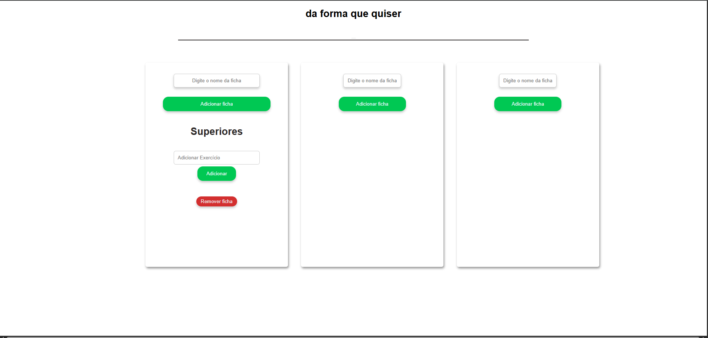
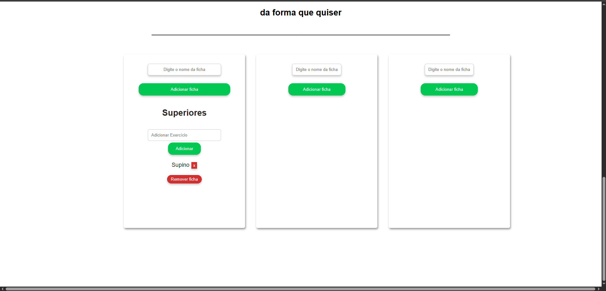
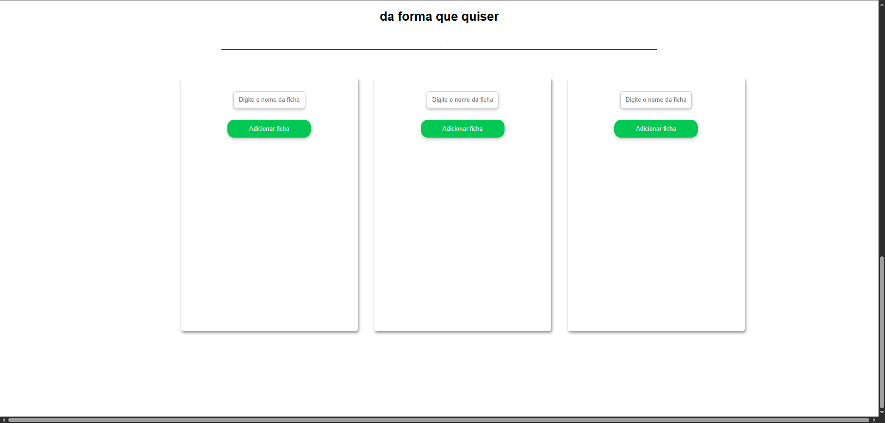
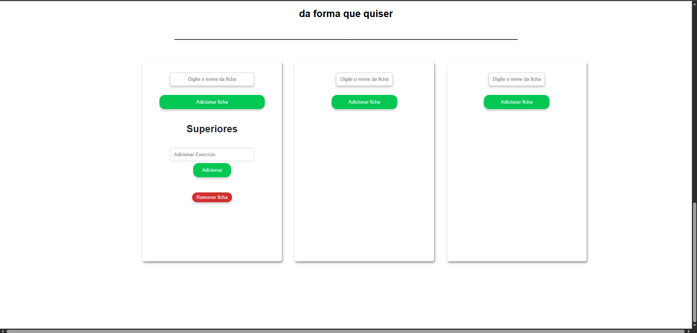
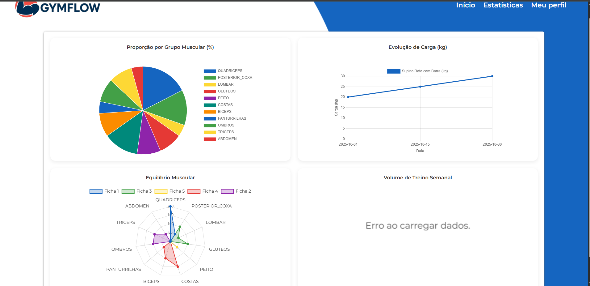

# Front-end Web

[Inclua uma breve descrição do projeto e seus objetivos.]

## Projeto da Interface Web

[Descreva o projeto da interface Web da aplicação, incluindo o design visual, layout das páginas, interações do usuário e outros aspectos relevantes.]

### Wireframes

[Inclua os wireframes das páginas principais da interface, mostrando a disposição dos elementos na página.]

### Design Visual

[Descreva o estilo visual da interface, incluindo paleta de cores, tipografia, ícones e outros elementos gráficos.]

## Fluxo de Dados

[Diagrama ou descrição do fluxo de dados na aplicação.]

## Tecnologias Utilizadas
[Lista das tecnologias principais que serão utilizadas no projeto.]

## Considerações de Segurança

[Discuta as considerações de segurança relevantes para a aplicação distribuída, como autenticação, autorização, proteção contra ataques, etc.]

## Implantação

[Instruções para implantar a aplicação distribuída em um ambiente de produção.]

1. Defina os requisitos de hardware e software necessários para implantar a aplicação em um ambiente de produção.
2. Escolha uma plataforma de hospedagem adequada, como um provedor de nuvem ou um servidor dedicado.
3. Configure o ambiente de implantação, incluindo a instalação de dependências e configuração de variáveis de ambiente.
4. Faça o deploy da aplicação no ambiente escolhido, seguindo as instruções específicas da plataforma de hospedagem.
5. Realize testes para garantir que a aplicação esteja funcionando corretamente no ambiente de produção.

## Testes

### Casos de Teste

### 1. Página de Cadastro

### Funcionalidade: Cadastrar novo usuário

| Caso de Teste | Descrição | Entrada | Resultado Esperado | Print da Execução | Status |
|----------------|------------|----------|--------------------|-------------------|--------|
| CT-01 | Campos obrigatórios vazios | Nome, email e senha em branco | Exibir popup “Preencha todos os campos!” |  | Sucesso |
| CT-02 | Email inválido | `usuario@teste` | Exibir popup “Email inválido!” |  | Sucesso |
| CT-03 | Senha menor que 4 caracteres | `123` | Exibir popup “A senha deve ter pelo menos 4 caracteres.” |  | Sucesso |
| CT-04 | Email já cadastrado | Email existente no banco | Exibir popup “Este email já está cadastrado!” |  | Sucesso |
| CT-05 | Cadastro bem-sucedido | Nome, email e senha válidos | Exibir popup “Cadastro realizado com sucesso!” e registrar usuário no backend |  | Sucesso |

### 2. Página de Login

### Funcionalidade: Autenticar usuário

| Caso de Teste | Descrição | Entrada | Resultado Esperado | Print da Execução | Status |
|----------------|------------|----------|--------------------|-------------------|--------|
| CT-06 | Campos obrigatórios vazios | Email e senha em branco | Exibir popup “Preencha todos os campos!” |  | Sucesso |
| CT-07 | Email inválido | `usuario@teste` | Exibir popup “Email inválido!” |  | Sucesso |
| CT-08 | Credenciais incorretas | Email ou senha inválidos | Exibir popup “Email ou senha inválidos!” |  | Sucesso |
| CT-09 | Login bem-sucedido | Email e senha corretos | Salvar token no localStorage e redirecionar para MenuPrincipal |  | Sucesso |

### Funcionalidade: Redefinir senha

| Caso de Teste | Descrição | Entrada | Resultado Esperado | Print da Execução | Status |
|----------------|------------|----------|--------------------|-------------------|--------|
| CT-10 | Campos obrigatórios vazios | Nome, email ou senha vazios | Exibir popup “Preencha todos os campos!” | - | API para redefinição de senha ainda não implementada |
| CT-11 | Email inválido | `email@teste` | Exibir popup “Email inválido!” | - | API para redefinição de senha ainda não implementada |
| CT-12 | Senha muito curta | `123` | Exibir popup “A senha deve ter pelo menos 4 caracteres.” | - | API para redefinição de senha ainda não implementada |
| CT-13 | Redefinição bem-sucedida | Nome e email válidos + nova senha | Exibir popup “Senha redefinida com sucesso!” | - | API para redefinição de senha ainda não implementada |
| CT-14 | Nome/email inexistente | Dados não encontrados | Exibir popup “Email ou nome inválidos!” | - | API para redefinição de senha ainda não implementada |

### 3. Página do Usuário

### Funcionalidade: Editar e salvar dados pessoais

| Caso de Teste | Descrição | Entrada | Resultado Esperado | Print da Execução | Status |
|----------------|------------|----------|--------------------|-------------------|--------|
| CT-17 | Editar campos vazios | Nome ou email em branco | Exibir popup “Por favor, insira um nome/email válido.” | - | API para edição de usuarios ainda não implementada |
| CT-18 | Valores inválidos | Idade, peso ou altura negativos | Exibir popup “Por favor, insira valores válidos.” | - | API para edição de usuarios ainda não implementada |
| CT-19 | Atualização bem-sucedida | Todos os campos válidos | Exibir popup “Dados salvos com sucesso!” | print | - | API para edição de usuarios ainda não implementada |

### Funcionalidade: Metas do Usuário

| Caso de Teste | Descrição | Entrada | Resultado Esperado | Print da Execução | Status |
|----------------|------------|----------|--------------------|-------------------|--------|
| CT-20 | Criar meta vazia | Campo de texto vazio | Exibir popup “Digite uma meta válida!” |  | Sucesso
| CT-21 | Criar meta válida | Texto preenchido | Adicionar meta à lista |  | ERRO
| CT-22 | Concluir meta | Marcar checkbox | Atualizar estado da meta no backend | - | API para edição de usuarios ainda não implementada |
| CT-23 | Deletar meta | Clicar no ícone de lixeira | Remover meta da lista e do backend | - | API para edição de usuarios ainda não implementada |

### Funcionalidade: IMC do Usuário

| Caso de Teste | Descrição | Entrada | Resultado Esperado | Print da Execução | Status |
|----------------|------------|----------|--------------------|-------------------|--------|
| CT-24 | Cálculo correto do IMC | Peso 70kg, Altura 170cm | Exibir IMC = 24.22 (Normal) | - | API para edição de usuarios ainda não implementada |

### 4. Menu Principal 

### Funcionalidade: Cadastrar novo treino ou removê-lo

| Caso de Teste | Descrição | Entrada | Resultado Esperado | Print da Execução | Status |
|----------------|------------|----------|--------------------|-------------------|--------|
CT-25| Criar uma ficha e cadastrar um modelo de treino experimental | Campo de texto vazio | O treino ser cadastrado na página para avaliação |  | Sucesso
CT-26| Criar um exercício e cadastrar um modelo experimental | Campo de texto vazio | O treino ser cadastrado na página para avaliação |  | Sucesso
CT-27| Remover o treino teste que foi colocado na lista |Botão | O treino ser excluído com sucesso |  | Sucesso
CT-28| Remover o exercício teste que foi colocado na lista |Botão | O treino ser excluído com sucesso |  | Sucesso

### 5. Estatísiticas

### Funcinalidade: Visualizar as planilhas

| Caso de Teste | Descrição | Entrada | Resultado Esperado | Print da Execução | Status |
|----------------|------------|----------|--------------------|-------------------|--------|
CT-29| Entrar com uma conta e visualizar os gráficos que foram criados para o perfil | Nenhuma | O conteúdo ser carregado corretamente |  | Sucesso
---
# Referências

Inclua todas as referências (livros, artigos, sites, etc) utilizados no desenvolvimento do trabalho.

# Planejamento

##  Quadro de tarefas

> Apresente a divisão de tarefas entre os membros do grupo e o acompanhamento da execução, conforme o exemplo abaixo.

### Semana 1

Atualizado em: 21/04/2024

| Responsável   | Tarefa/Requisito | Iniciado em    | Prazo      | Status | Terminado em    |
| :----         |    :----         |      :----:    | :----:     | :----: | :----:          |
| AlunaX        | Introdução | 01/02/2024     | 07/02/2024 | ✔️    | 05/02/2024      |
| AlunaZ        | Objetivos    | 03/02/2024     | 10/02/2024 | 📝    |                 |
| AlunoY        | Histórias de usuário  | 01/01/2024     | 07/01/2005 | ⌛     |                 |
| AlunoK        | Personas 1  |    01/01/2024        | 12/02/2005 | ❌    |       |

#### Semana 2

Atualizado em: 21/04/2024

| Responsável   | Tarefa/Requisito | Iniciado em    | Prazo      | Status | Terminado em    |
| :----         |    :----         |      :----:    | :----:     | :----: | :----:          |
| AlunaX        | Página inicial   | 01/02/2024     | 07/03/2024 | ✔️    | 05/02/2024      |
| AlunaZ        | CSS unificado    | 03/02/2024     | 10/03/2024 | 📝    |                 |
| AlunoY        | Página de login  | 01/02/2024     | 07/03/2024 | ⌛     |                 |
| AlunoK        | Script de login  |  01/01/2024    | 12/03/2024 | ❌    |       |

Legenda:
- ✔️: terminado
- 📝: em execução
- ⌛: atrasado
- ❌: não iniciado

