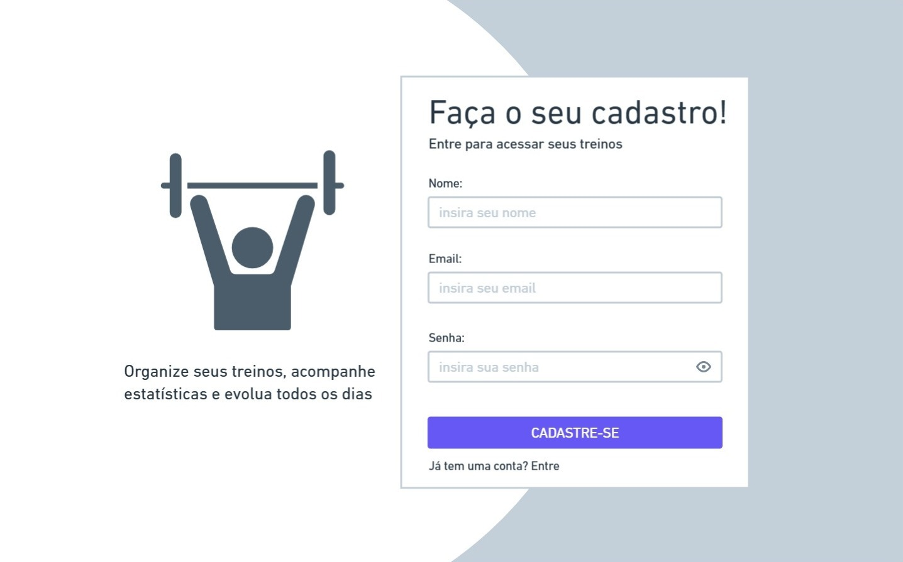
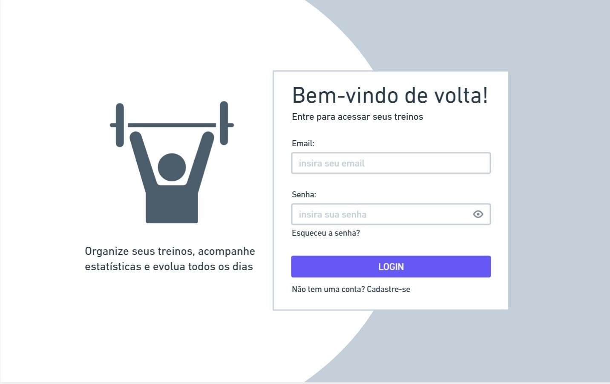
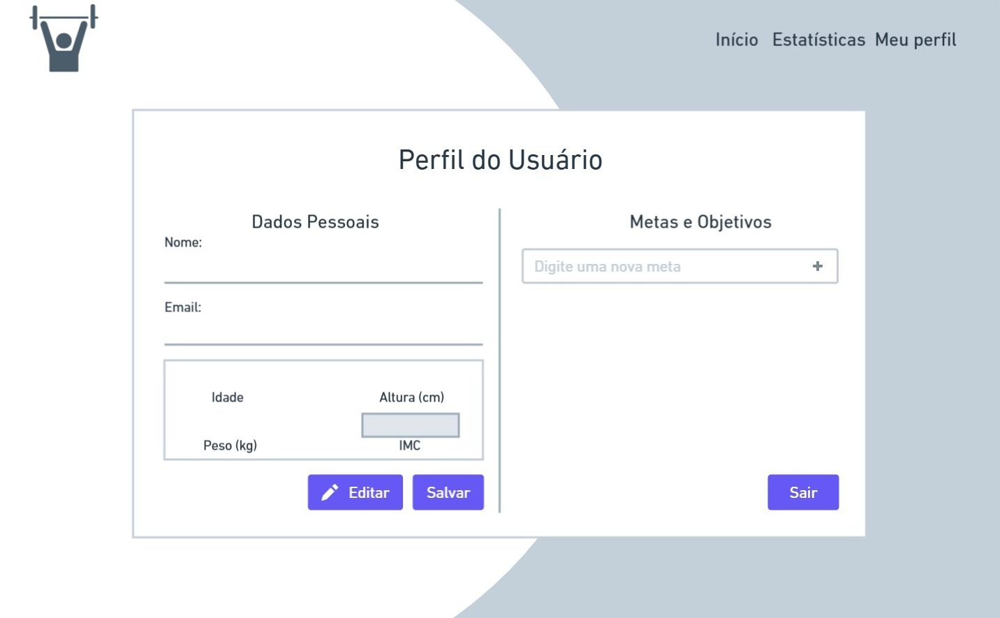
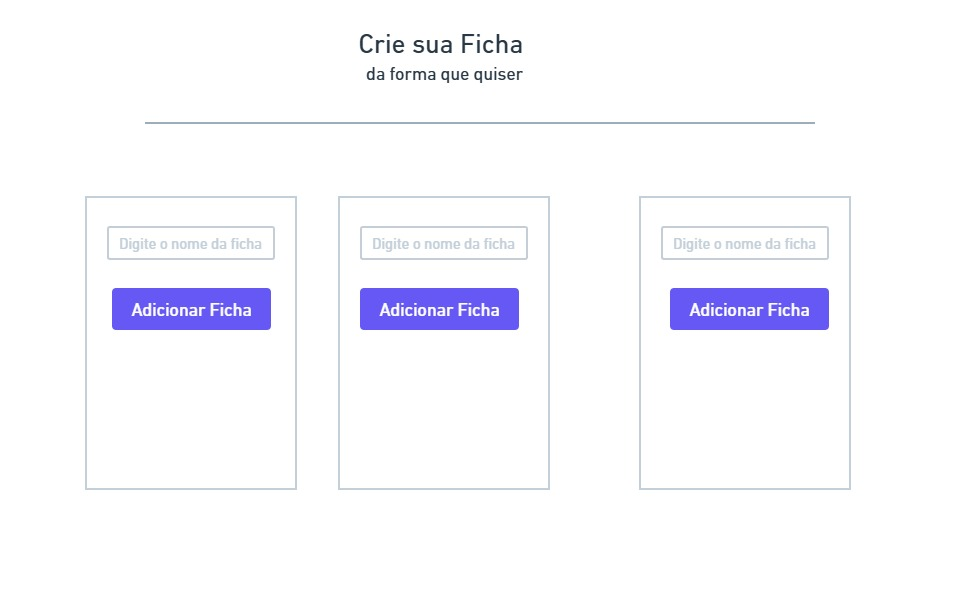
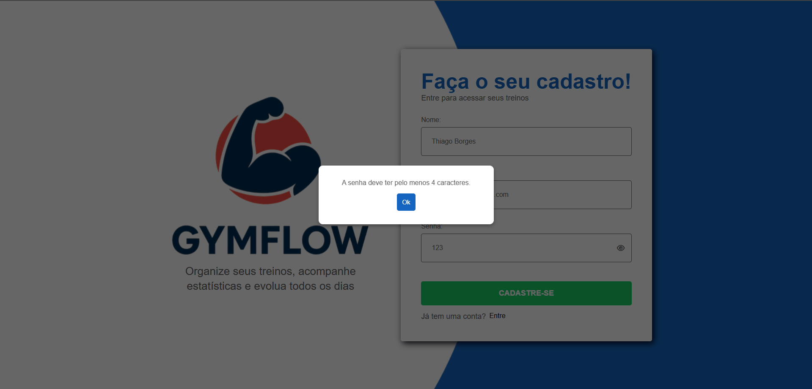
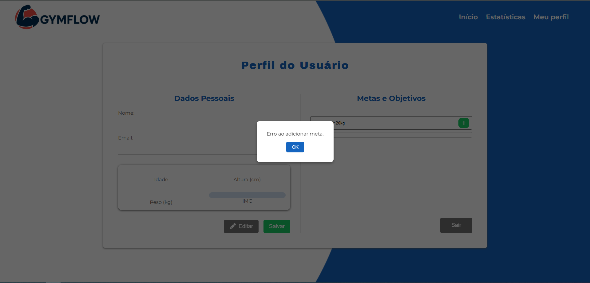

# Front-end Web

O front-end web faz parte da arquitetura distribuída do sistema de acompanhamento de treinos, desenvolvido com o objetivo de oferecer uma experiência completa para os praticantes de musculação.  
A versão web tem foco principal na visualização de estatísticas, relatórios e gráficos de desempenho, além de permitir o gerenciamento detalhado dos treinos e das informações de perfil do usuário\*\*.  
Por meio da interface web, o usuário poderá acompanhar sua evolução de forma clara e objetiva, analisar dados históricos e gerenciar as rotinas de treino de maneira organizada e centralizada.

---

## Projeto da Interface Web

A interface web será projetada com base em usabilidade, clareza e eficiência, conforme os requisitos não funcionais do sistema.  
Seu design seguirá uma linha intuitiva, evitando elementos que possam distrair o usuário, garantindo uma navegação fluida e direta aos recursos essenciais.

O foco principal do projeto da interface web é fornecer uma experiência visual agradável, responsiva e centrada na análise de resultados, em contraste com o aplicativo mobile, que prioriza a praticidade do registro durante o treino.

## Wireframes

Os wireframes a seguir representam o esboço visual das principais telas do GymFlow, aplicativo mobile voltado à organização e acompanhamento de treinos. Esta etapa teve como objetivo definir a estrutura visual e funcional do sistema, facilitando a visualização do fluxo de navegação do usuário entre as telas de login, menu inicial, cronômetro e perfil.

O uso de wireframes permitiu validar antecipadamente a experiência do usuário (UX), garantindo que a disposição dos elementos na interface seja intuitiva, acessível e coerente com a proposta do aplicativo. A seguir, são apresentados os wireframes desenvolvidos para o GymFlow, que serviram de base para o desenvolvimento do protótipo funcional:

## Fluxo de dados
### 1. Página de Cadastro

| Etapa | Origem | Destino | Tipo de Dado | Descrição |
|-------|---------|----------|---------------|------------|
| 1 | Usuário | Front-end | Texto | Inserção de nome, email e senha |
| 2 | Front-end | Front-end | Texto / Booleano | Validação dos campos (não vazios, formato do email, tamanho da senha) |
| 3 | Front-end | API `/api/usuarios` | JSON | Envio dos dados do novo usuário `{ nome, email, senha }` |
| 4 | API | Front-end | JSON | Retorno de confirmação ou mensagem de erro (ex: email já cadastrado) |
| 5 | Front-end | Usuário | Texto (mensagem) | Exibição do popup com o resultado do cadastro |

### 2. Página de Login

| Etapa | Origem | Destino | Tipo de Dado | Descrição |
|-------|---------|----------|---------------|------------|
| 1 | Usuário | Front-end | Texto | Inserção de email e senha |
| 2 | Front-end | Front-end | Texto / Booleano | Verificação de campos e formato de email |
| 3 | Front-end | API `/api/usuarios/login` | JSON | Envio das credenciais de login |
| 4 | API | Front-end | JSON | Retorno de token JWT ou mensagem de erro |
| 5 | Front-end | LocalStorage | String | Armazenamento do token JWT |
| 6 | Front-end | Página Principal | URL | Caminho de redirecionamento após login |
| 7 | Usuário | API `/api/---/--` | JSON | Dados para redefinição de senha |
| 8 | Front-end | Usuário | Texto (mensagem) | Feedback visual de sucesso ou erro |

### 3. Página do Usuário

| Etapa | Origem | Destino | Tipo de Dado | Descrição |
|-------|---------|----------|---------------|------------|
| 1 | Front-end | LocalStorage | String | Verificação do token JWT armazenado para autenticação |
| 2 | Front-end | API `/api/usuarios/---` | JSON | Requisição GET para carregar os dados do usuário autenticado |
| 3 | API | Front-end | JSON | Retorno com informações do usuário (nome, email, idade, altura, peso) |
| 4 | Front-end | Interface | Texto / Numérico | Preenchimento dos campos de perfil com os dados recebidos |
| 5 | Usuário | Front-end | Texto / Número | Edição de dados pessoais e confirmação de salvamento |
| 6 | Front-end | API `/api/usuarios/---` | JSON | Envio dos dados atualizados do perfil |
| 7 | API | Front-end | JSON | Resposta de sucesso ou erro da atualização |
| 8 | Front-end | Interface | Texto (mensagem) | Exibição de popup informando o status do salvamento |
| 9 | Front-end | API `/---` | JSON | Requisição GET para carregar metas cadastradas |
| 10 | API | Front-end | JSON | Retorno com lista de metas existentes |
| 11 | Usuário | Front-end | Texto | Inserção de nova meta no campo de texto |
| 12 | Front-end | API `/----` | JSON | Envio da nova meta  |
| 13 | API | Front-end | JSON | Retorno da meta criada (id, texto, status) |
| 14 | Usuário | Front-end | Booleano | Marcação de meta como concluída (checkbox) |
| 15 | Front-end | API `/---/--` | JSON | Atualização do status da meta  |
| 16 | Usuário | Front-end | Evento | Exclusão manual de meta |
| 17 | Front-end | API `/---/--` | Nenhum (DELETE) | Requisição para excluir a meta selecionada |
| 18 | API | Front-end | Código HTTP | Retorno de sucesso ou erro na exclusão |
| 19 | Front-end | Interface | Texto / Numérico | Atualização automática do IMC com base em peso e altura |
| 20 | Usuário | Front-end | Evento | Clique em “Sair” limpa o estado e redireciona para a página inicial |

### 4. Menu Principal

| Etapa | Origem | Destino | Tipo de Dado | Descrição |
|-------|---------|----------|---------------|------------|
| 1 | Front-end | LocalStorage | Texto | Cadastrar uma ficha teste de treino |
| 2 | Front-end | LocalStorage | Texto | Cadastrar um exercício teste de treino |
| 3 | Front-end | LocalStorage | Texto | Remover Ficha adicionada |
| 4 | Front-end | LocalStorage | Texto | Remover Exercício teste adicionado |

### 5. Estatísticas

| Etapa | Origem | Destino | Tipo de Dado | Descrição |
|-------|---------|----------|---------------|------------|
| 1 | Front-end | LocalStorage | String | Verificação do token JWT armazenado para autenticação |
| 2 |API | Interface | Json| Gráficos| Tabelas criadas para visualização |

---
##### Tela de Cadastro

##### Tela de Login

##### Tela de Perfil

##### Tela de Fichas

##### Cadastro de Fichas

##### Tela de Estatísticas

##### Iconografia

   
   
  

### Design Visual

## Design Visual

**Paleta de cores**

- **Primária (#1565C0)** — Azul intenso utilizado nos títulos, links e elementos de destaque. Transmite **confiança, estabilidade e foco**.
- **Secundária (#121212)** — Cor **escura** usada em fundos e áreas de contraste.
- **Apoio (#00C853)** — Verde vibrante que destaca **botões de ação** (como “CADASTRE-SE”), indicando **sucesso e positividade**.
- **Neutros (#616161 e #FFFFFF)** — Tons de **cinza médio e branco puro** para equilibrar o contraste e garantir boa legibilidade.
- **Feedback (#FF6D00 e #D32F2F)** — Tons de **laranja** e **vermelho** aplicados para **alertas e erros**.

**Tipografia**

- **Títulos:** _Archivo Black_ — Fonte, que reforça a **força e a presença** da marca.
- **Textos e rótulos:** _Montserrat_ — Moderna e legível, garantindo **clareza e leveza** no corpo do texto e nos campos de formulário.

**Ícones e Elementos Gráficos**

O logotipo em azul escuro sobre um círculo vermelho-alaranjado, simbolizando energia, determinação e superação — valores centrais da marca. Os ícones secundários, como o **ícone de exibição de senha**, seguindo a consistência visual do sistema.

**Geral**

O design do GymFlow comunica **energia e modernidade**. A combinação de azul e verde reforça **confiança e progresso**, enquanto a tipografia e os ícones tornam a experiência **acessível e agradável**. O resultado é uma interface ideal para um app voltado à organização e acompanhamento de treinos.

**Cadastro**

**Login**

**Cadastro de Fichas**

**Estatisticas**

**Perfil do Usuário**

**Home Page**

## Fluxo de Dados

[Diagrama ou descrição do fluxo de dados na aplicação.]

## Tecnologias Utilizadas

| Categoria                                  | Tecnologia / Ferramenta                                               |
| ------------------------------------------ | --------------------------------------------------------------------- |
| **Linguagem**                              | JavaScript, HTML                                                      |
| **Estilo e Layout**                        | CSS                                                                   |
| **Hospedagem**                             | Vercel                                                                |
| **Banco de Dados (via Backend)**           | PostgreSQL                                                            |
| **Integração com API**                     | Consumo de endpoints REST fornecidos pelo backend em Java/Spring Boot |
| **Controle de Versão**                     | GitHub (repositório remoto)                                           |
| **Containerização (infraestrutura geral)** | Docker                                                                |

Essas tecnologias garantem compatibilidade, desempenho e fácil integração com os demais módulos (mobile e backend).

## Considerações de Segurança

A aplicação web segue as diretrizes gerais de segurança estabelecidas no projeto, garantindo proteção dos dados e autenticação segura.

Essas medidas asseguram a integridade e confidencialidade das informações do usuário durante a navegação e manipulação dos dados no sistema.

## Implantação

[Instruções para implantar a aplicação distribuída em um ambiente de produção.]

1. Defina os requisitos de hardware e software necessários para implantar a aplicação em um ambiente de produção.
2. Escolha uma plataforma de hospedagem adequada, como um provedor de nuvem ou um servidor dedicado.
3. Configure o ambiente de implantação, incluindo a instalação de dependências e configuração de variáveis de ambiente.
4. Faça o deploy da aplicação no ambiente escolhido, seguindo as instruções específicas da plataforma de hospedagem.
5. Realize testes para garantir que a aplicação esteja funcionando corretamente no ambiente de produção.

## Testes

### Casos de Teste

### 1. Página de Cadastro

### Funcionalidade: Cadastrar novo usuário

| Caso de Teste | Descrição                    | Entrada                       | Resultado Esperado                                                            | Print da Execução              | Status  |
| ------------- | ---------------------------- | ----------------------------- | ----------------------------------------------------------------------------- | ------------------------------ | ------- |
| CT-01         | Campos obrigatórios vazios   | Nome, email e senha em branco | Exibir popup “Preencha todos os campos!”                                      |  | Sucesso |
| CT-02         | Email inválido               | `usuario@teste`               | Exibir popup “Email inválido!”                                                |  | Sucesso |
| CT-03         | Senha menor que 4 caracteres | `123`                         | Exibir popup “A senha deve ter pelo menos 4 caracteres.”                      |  | Sucesso |
| CT-04         | Email já cadastrado          | Email existente no banco      | Exibir popup “Este email já está cadastrado!”                                 |  | Sucesso |
| CT-05         | Cadastro bem-sucedido        | Nome, email e senha válidos   | Exibir popup “Cadastro realizado com sucesso!” e registrar usuário no backend |  | Sucesso |

### 2. Página de Login

### Funcionalidade: Autenticar usuário

| Caso de Teste | Descrição                  | Entrada                  | Resultado Esperado                                             | Print da Execução              | Status  |
| ------------- | -------------------------- | ------------------------ | -------------------------------------------------------------- | ------------------------------ | ------- |
| CT-06         | Campos obrigatórios vazios | Email e senha em branco  | Exibir popup “Preencha todos os campos!”                       |  | Sucesso |
| CT-07         | Email inválido             | `usuario@teste`          | Exibir popup “Email inválido!”                                 |  | Sucesso |
| CT-08         | Credenciais incorretas     | Email ou senha inválidos | Exibir popup “Email ou senha inválidos!”                       |  | Sucesso |
| CT-09         | Login bem-sucedido         | Email e senha corretos   | Salvar token no localStorage e redirecionar para MenuPrincipal |  | Sucesso |

### Funcionalidade: Redefinir senha

| Caso de Teste | Descrição                  | Entrada                           | Resultado Esperado                                       | Print da Execução | Status                                               |
| ------------- | -------------------------- | --------------------------------- | -------------------------------------------------------- | ----------------- | ---------------------------------------------------- |
| CT-10         | Campos obrigatórios vazios | Nome, email ou senha vazios       | Exibir popup “Preencha todos os campos!”                 | -                 | API para redefinição de senha ainda não implementada |
| CT-11         | Email inválido             | `email@teste`                     | Exibir popup “Email inválido!”                           | -                 | API para redefinição de senha ainda não implementada |
| CT-12         | Senha muito curta          | `123`                             | Exibir popup “A senha deve ter pelo menos 4 caracteres.” | -                 | API para redefinição de senha ainda não implementada |
| CT-13         | Redefinição bem-sucedida   | Nome e email válidos + nova senha | Exibir popup “Senha redefinida com sucesso!”             | -                 | API para redefinição de senha ainda não implementada |
| CT-14         | Nome/email inexistente     | Dados não encontrados             | Exibir popup “Email ou nome inválidos!”                  | -                 | API para redefinição de senha ainda não implementada |

### 3. Página do Usuário

### Funcionalidade: Editar e salvar dados pessoais

| Caso de Teste | Descrição                | Entrada                         | Resultado Esperado                                     | Print da Execução | Status                                             |
| ------------- | ------------------------ | ------------------------------- | ------------------------------------------------------ | ----------------- | -------------------------------------------------- | -------------------------------------------------- |
| CT-17         | Editar campos vazios     | Nome ou email em branco         | Exibir popup “Por favor, insira um nome/email válido.” | -                 | API para edição de usuarios ainda não implementada |
| CT-18         | Valores inválidos        | Idade, peso ou altura negativos | Exibir popup “Por favor, insira valores válidos.”      | -                 | API para edição de usuarios ainda não implementada |
| CT-19         | Atualização bem-sucedida | Todos os campos válidos         | Exibir popup “Dados salvos com sucesso!”               | print             | -                                                  | API para edição de usuarios ainda não implementada |

### Funcionalidade: Metas do Usuário

| Caso de Teste | Descrição         | Entrada                    | Resultado Esperado                     | Print da Execução              | Status                                             |
| ------------- | ----------------- | -------------------------- | -------------------------------------- | ------------------------------ | -------------------------------------------------- |
| CT-20         | Criar meta vazia  | Campo de texto vazio       | Exibir popup “Digite uma meta válida!” |  | Sucesso                                            |
| CT-21         | Criar meta válida | Texto preenchido           | Adicionar meta à lista                 |  | ERRO                                               |
| CT-22         | Concluir meta     | Marcar checkbox            | Atualizar estado da meta no backend    | -                              | API para edição de usuarios ainda não implementada |
| CT-23         | Deletar meta      | Clicar no ícone de lixeira | Remover meta da lista e do backend     | -                              | API para edição de usuarios ainda não implementada |

### Funcionalidade: IMC do Usuário

| Caso de Teste | Descrição              | Entrada                 | Resultado Esperado          | Print da Execução | Status                                             |
| ------------- | ---------------------- | ----------------------- | --------------------------- | ----------------- | -------------------------------------------------- |
| CT-24         | Cálculo correto do IMC | Peso 70kg, Altura 170cm | Exibir IMC = 24.22 (Normal) | -                 | API para edição de usuarios ainda não implementada |

# Referências

Inclua todas as referências (livros, artigos, sites, etc) utilizados no desenvolvimento do trabalho.
